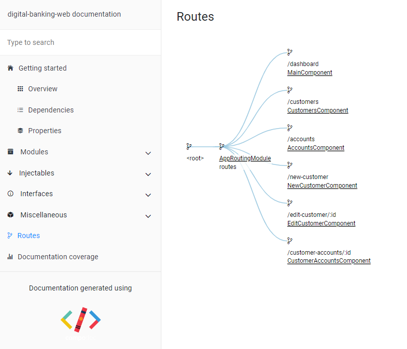
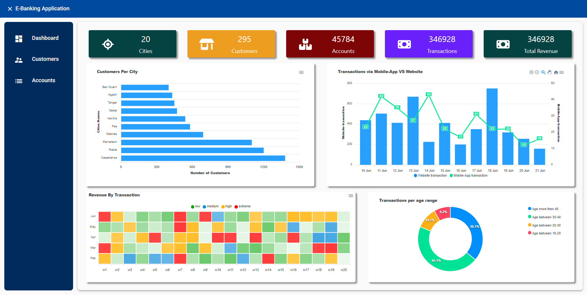
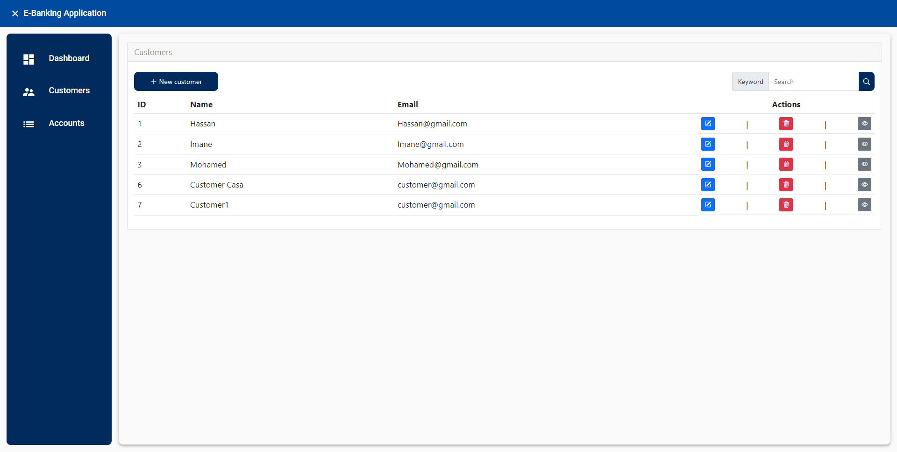
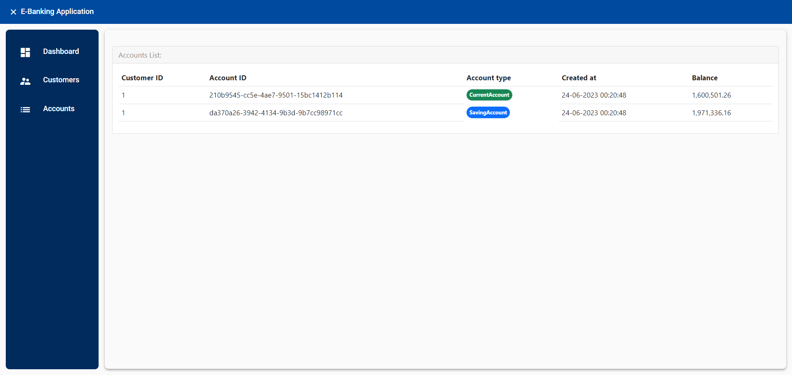
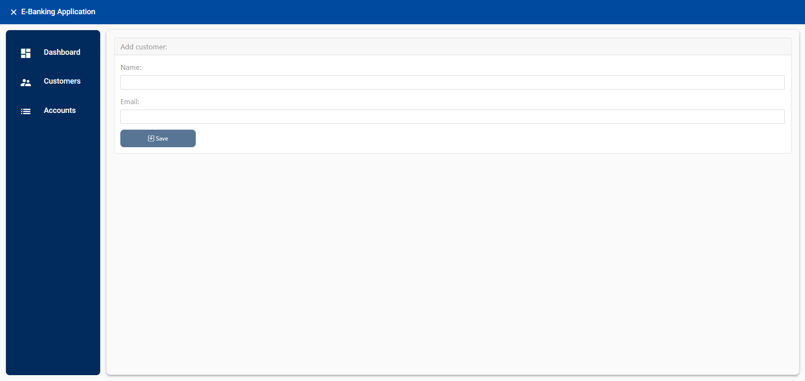
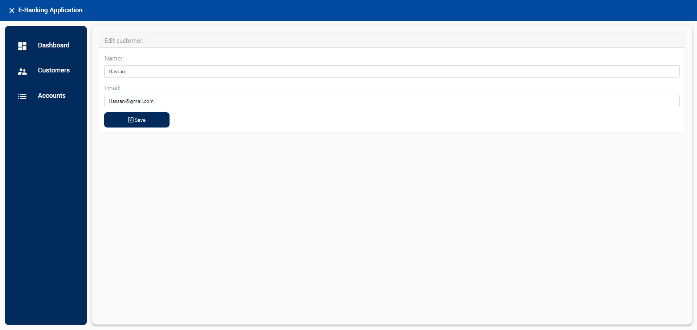
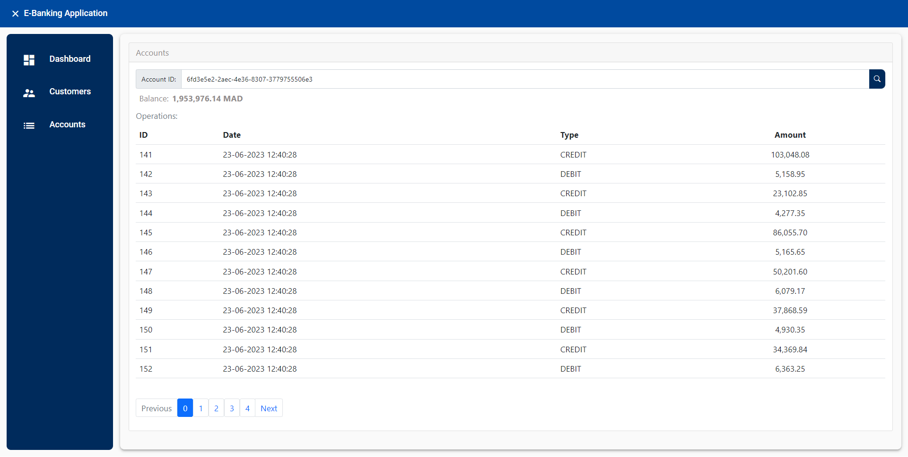

# Ebank-Jee-FrontEnd
  Welcome to our Angular Frontend Project!

  This repository houses the frontend codebase of our digital banking application developed using Angular. Angular is a powerful and popular framework for building modern web applications with a focus on performance, 
scalability, and maintainability.

  In this project, we have utilized Angular's features and best practices to create a user-friendly and responsive frontend interface. Our goal was to provide a seamless and engaging experience for our users, 
allowing them to manage their bank accounts efficiently.

## Getting Started 

__Clone the repository__
```
git clone https://github.com/chifaabelmaaza/Ebank-Jee-FrontEnd.git
```

__Go the folder__
```
Ebank-Jee-FrontEnd
```
__Install dependencies__
```
npm install
```
__Launch the application__
```
ng serve --open
```
> Note: Make sure you have Node.js and Angular CLI installed on your machine to run the frontend application.

## Key Features

- Modern and Intuitive User Interface: We have designed a clean and intuitive user interface to enhance the overall user experience.
- Responsive Design: Our application is built with a responsive design, ensuring compatibility and optimal display across various devices and screen sizes.
- Single Page Application (SPA): With Angular's SPA architecture, users can navigate through different sections of the application without experiencing page reloads.
- Component-Based Development: We have followed Angular's component-based architecture, enabling code reusability, modularity, and easier maintenance.
- Reactive Forms: Angular's reactive forms feature has been utilized to implement robust form validation and seamless data binding.
- Efficient Routing and Navigation: Angular's powerful routing capabilities allow for seamless navigation between different views and sections of the application.

## Tools and Technologies

- Angular CLI: We have used the Angular CLI (Command Line Interface) for scaffolding, building, and deploying our Angular application.
- Angular Material: Angular Material, a UI component library, has been leveraged to achieve a consistent and visually appealing design.
- ApexCharts: We have integrated ApexCharts, a modern charting library, to visualize and present data in an engaging and informative way.
- Font Awesome: We have utilized Font Awesome, a popular icon library, to enhance the visual representation of various elements in our application.
- @fortawesome/angular-fontawesome: The @fortawesome/angular-fontawesome package has been employed to easily incorporate Font Awesome icons into our Angular components.
- @fortawesome/fontawesome-svg-core: We have used the @fortawesome/fontawesome-svg-core package to handle the loading and management of Font Awesome SVG icons.
- @fortawesome/free-solid-svg-icons: This package provides a wide range of free solid SVG icons from Font Awesome that we can utilize in our application.

We are excited to showcase our Angular frontend project and invite you to explore the codebase and experience the seamless user interface we have developed for our digital banking application.

## Routes 



## Screans 

__Dashboard__



__Customers__

1. List

   

2. View Customer's accounts

   

3. Add Customer

   

4. Edit Customer

   

__Accounts__

Search for Account's operations history




> Note: Please refer to the project documentation for detailed instructions on setting up and running the frontend application. Feel free to reach out to us with any questions or feedback.

Happy exploring and thank you for your interest in our Angular frontend project!

